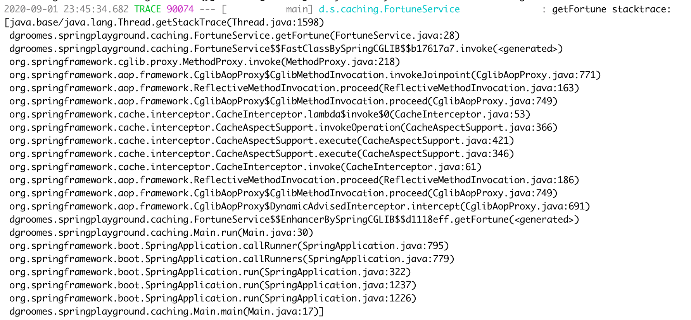

# caching

A basic Spring Boot application that showcases caching.


## Overview

Spring Boot (<https://spring.io/projects/spring-boot>) has a significant amount of software machinery around
caching ([relevant section in docs](https://docs.spring.io/spring-boot/docs/current/reference/html/spring-boot-features.html#boot-features-caching)).
This project aims to de-mystify and illuminate it. Let's learn something!


## Instructions

Follow these instructions to build and run the example program.

1. Use Java 17
2. Source the `commands.sh` file
    * ```shell
      . commands.sh
      ```
    * See [`commands.sh`](#commandssh) for more information.
3. Build and run the program:
    * ```shell
      build && run
      ```
4. Study the output
    * The program is configured to log caching-related operations which illuminate the effect of caching. For example,
      the program attempts to reveal Damon's fortune for the first time and this results in a *cache miss* which you can
      tell from the following log.
    * ```text
      No cache entry for key 'Damon' in cache(s) [fortune]
      ```
    * A fortune is created for Damon. For example, you will see a log like the following (the number is randomized, so 
      it will be different for you).
    * ```text
      Damon, your lucky number is 7
      ```
    * Later, Damon's fortune is revealed again and this results in a *cache hit* which you can tell from the following
      log.
    * ```text
      Cache entry for key 'Damon' found in cache 'fortune'
      ```
    * And his same fortune (lucky number 7) is revealed again.
    * But on the next attempt, we can infer that the cache entry must have expired because we find another cache miss.
    * ```text
      No cache entry for key 'Damon' in cache(s) [fortune]
      ```
    * Damon's fortune is created anew. And this time it's different.
    * ```text
      Damon, your lucky number is 3
      ``` 

In sum, this program provided a working example of the lifecycle of a basic caching scheme:

1. Cache miss
2. Create/lookup operation
3. Cache set
4. Cache hit.
5. Time elapses... There are cache hits until the cache entry expires. 
6. Cache expire. REPEAT from step 1.  


## `commands.sh`

Source the `commands.sh` file using `source commands.sh` which will load your shell with useful commands. Commands
include:

* `build` build
* `run` run the app


## Commentary

Here is a gentle reminder: Spring Framework provides abstractions over other technologies. For example, read this quote
from <https://docs.spring.io/spring/docs/5.2.8.RELEASE/spring-framework-reference/integration.html#cache-strategies>:

> As with other services in the Spring Framework, the caching service is an abstraction (not a cache implementation) and requires the use of actual storage to store the cache data–that is, the abstraction frees you from having to write the caching logic but does not provide the actual data store.

This `caching/` subproject of the `spring-playground/` project demonstrates Spring's caching abstraction in action.
Specifically it shows how to use the abstraction in the application code with the convenient `@Cacheable` annotation and
how the abstraction layer does not extend to the *configuration* of the underlying caching technology (in this case
<https://github.com/ben-manes/caffeine>). This might be considered a *leaky abstraction*.

For reference, here are the two sections in the Spring Boot documentation that describe how to set up basic caching plus
basic metrics. They are:

* <https://docs.spring.io/spring-boot/docs/current/reference/html/spring-boot-features.html#boot-features-caching>
* <https://docs.spring.io/spring-boot/docs/current/reference/html/production-ready-features.html#production-ready-metrics-cache>
* Bonus. Spring *Framework* documentation about
  caching: <https://docs.spring.io/spring/docs/5.2.8.RELEASE/spring-framework-reference/integration.html#cache>

I think I need to enable statistics in the Caffeine cache. I found that via Googling, in the Caffeine official docs on
the GitHub repo: <https://github.com/ben-manes/caffeine/wiki/Statistics>.

The application prints the stack trace from inside a `@Cacheable`-annotated method to illustrate the layers of Spring
and Spring Boot machinery between your application code and the `java` command used to run your application. In
particular, there are layers of generated classes, layers of method calls from classes in the `org.springframework.aop`
package (AOP stands for Aspect-Oriented Programming), and layers of method calls from classes in
the `org.springframework.cache.interceptor`
package. It looks like this:



This demo application enables caching metrics (after two days of head scratching I got it figured out). The metrics can
be conveniently browsed in the Spring Boot Actuator '/metrics' endpoint. Run the app and explore the cache metrics with,
for example:

* ```shell
  curl --request GET --url http://localhost:8080/actuator/metrics/cache.size
  ```
* ```shell
  curl --request GET --url http://localhost:8080/actuator/metrics/cache.evictions
  ```
* ```shell
  curl --request GET --url http://localhost:8080/actuator/metrics/cache.puts
  ```
  * Why is this always 0? Does Caffeine not track puts? I guess puts could be inferred from misses?
* ```shell
  curl --request GET --url http://localhost:8080/actuator/metrics/cache.gets
  ```
* ```shell
  curl --request GET --url 'http://localhost:8080/actuator/metrics/cache.gets?tag=cache%3Afortune&tag=result%3Ahit'
  ```
  * Drill down on cache hits.
* ```shell
  curl --request GET --url 'http://localhost:8080/actuator/metrics/cache.gets?tag=cache%3Afortune&tag=result%3Amiss'
  ```
  * Drill down on cache misses. 


## Wish List

General clean-ups, TODOs and things I wish to implement for this project:

* [ ] Can I configure a shorter log date/time format? For demo purposes, I really don't need the year/month/day or
  even fractional seconds.
